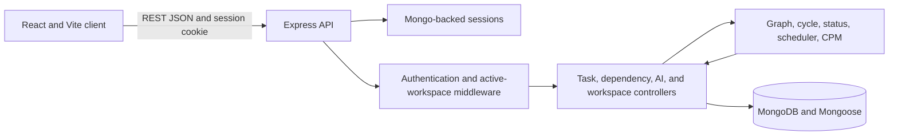

# TaskFlow Pro

TaskFlow Pro is a dependency-aware project board for teams coordinating work with real prerequisites. It combines a four-stage Kanban board with a directed acyclic graph (DAG), schedule propagation, critical-path analysis, workspace isolation, and an optional AI dependency advisor.

The product is designed for projects where a flat task list is not enough: teams need to know what is blocked, what can start, and how an upstream schedule change affects downstream work.

## Contents

- [Product overview](#product-overview)
- [Core concepts](#core-concepts)
- [User workflows](#user-workflows)
- [Architecture](#architecture)
- [Data model](#data-model)
- [API reference](#api-reference)
- [Local development](#local-development)
- [Configuration](#configuration)
- [First run](#first-run)
- [Testing](#testing)
- [Security and deployment](#security-and-deployment)
- [Current limitations](#current-limitations)
- [Project layout](#project-layout)

## Product Overview

The public product page is served at `/`. The authenticated workspace application is served at `/app`.

TaskFlow Pro currently provides:

- Four Kanban stages: Backlog, In Progress, Review, and Done.
- Account registration and sign-in with a server-backed session.
- Private workspaces, workspace switching, and owner/member access.
- Task creation, editing, scheduling, archiving, restore, and workspace export.
- Explicit prerequisite edges with cycle validation.
- Derived Blocked/Ready status and downstream status refresh.
- Date and duration propagation with non-compounding behavior on reconverging paths.
- Critical Path Method (CPM) metrics and a DAG inspector.
- Grounded AI dependency suggestions that require user approval.

## Core Concepts

### Board status and dependency status

`boardStatus` records execution progress and is one of `Backlog`, `In Progress`, `Review`, or `Done`. `dependencyStatus` is computed and is never stored as an independent field:

- A task with no prerequisites is `Ready`.
- A task is `Ready` when every prerequisite has `boardStatus: Done`.
- Otherwise, it is `Blocked`.

### Dependency direction

An edge `A -> B` means that B depends on A. The edge is stored in B's `dependsOn` list. The API rejects self-dependencies and any edge that would introduce a cycle before writing it.

### Schedule propagation

The scheduling engine processes tasks in topological order. Root tasks retain their configured start dates. A task with prerequisites starts at the latest prerequisite finish. Durations are whole calendar days, represented as 24-hour periods.

For a diamond such as `A -> B -> D` and `A -> C -> D`, delay is propagated along the longest path, not summed across both paths. A three-day delay to A therefore shifts D by three days, not six.

The scheduling endpoints use calendar dates. They do not currently model working days, holidays, time zones per workspace, or resource availability. CPM metrics are duration-based and expressed as day offsets; schedule propagation uses stored task start dates.

### Critical path

The CPM forward and backward passes calculate early/late day offsets and slack from task durations. Tasks with zero slack are returned as critical. The board marks those tasks, and the DAG inspector displays the calculated chain.

### Workspaces and access

Registration creates a user and an initial owned workspace. Owners can add existing TaskFlow accounts as members. Every task, dependency, scheduling, AI, archive, and export operation is scoped to the active workspace. Members can work with tasks; only owners can add members.

### Archive and export

Archiving is reversible and removes a task from the active board and scheduling graph. A task with dependents cannot be archived because removing it from the active graph would invalidate those relationships. Restore requires its prerequisites to be active. `DELETE /api/tasks/:id` remains the permanent-delete API and also blocks when dependents exist.

Workspace export returns a versioned JSON snapshot containing active and archived tasks, including prerequisite IDs. Import is not currently implemented.

### AI suggestions

The server supplies the current workspace's active task titles to the configured provider. Results are matched against real task titles, de-duplicated, and checked for cycles before they are returned. Suggestions are advisory; accepting an existing-task suggestion calls the normal dependency API. Accept/reject decisions are stored in the `aisuggestionaudits` collection.

To try the advisor, create a few related tasks first, then open a new task, enter its title (and optionally a description), and select **Scan Prerequisites**. For example, with existing tasks named **Create database schema** and **Build API endpoints**, scan a new task named **Build UI**. Review the recommendations and choose **Accept** for each prerequisite you want to attach, or dismiss recommendations you do not want. Save the new task when finished. Suggestions are only proposed; they do not create dependencies until accepted.

The advisor only recommends active tasks in the current workspace and filters out suggestions that do not match an existing task or would create a dependency cycle. If no plausible prerequisites are found, the UI reports that no recommendations were detected. If no provider key is configured or a provider call fails, the service uses a local keyword heuristic; this fallback is useful for a manual smoke test with matching titles such as **Build UI** and **Build API endpoints**. The UI does not currently expose a searchable AI decision history or provider provenance.

## User Workflows

### Sign in and open a workspace

1. Visit `/` for the product overview and select **Open your workspace**.
2. At `/app`, register or sign in. Registration creates an initial workspace.
3. Use the workspace selector to switch between memberships, or create another workspace.
4. Owners can add an existing account by email. Email invitations and account creation for invitees are not provided by the current flow.

### Create and move tasks

1. Create a task with a title, start date, and positive integer duration. Description and prerequisites are optional.
2. Select prerequisites manually or review AI suggestions. Each accepted suggestion is recorded and validated before being committed.
3. Move tasks between Kanban stages using drag-and-drop or the card's quick-move controls.
4. Changes are persisted through the REST API. Status changes cause downstream readiness to be recomputed.

### Manage dependencies and schedules

1. Open a task's dependency manager to add or remove prerequisite edges.
2. A cycle attempt returns `409 CYCLE_DETECTED` with the conflicting path and does not write the edge.
3. Edit a task's start date or duration, or use the reschedule action. The server recalculates active downstream dates in topological order and returns the affected tasks.
4. Use **Inspect DAG** to examine dependency tiers, Blocked/Ready state, and critical-path membership.

### Archive, restore, and export

1. Archive a task from its card. The operation is rejected if any task depends on it.
2. Open **Archive** to review archived tasks and restore them. If a prerequisite is archived, restore that prerequisite first.
3. Use **Export workspace** to download a JSON snapshot of active and archived tasks for backup or external processing.

## Architecture



The backend separates HTTP handlers from pure graph calculations:

| Area | Responsibility |
|---|---|
| `server/src/routes` | Maps HTTP methods and paths to controllers. |
| `server/src/middleware/auth.middleware.ts` | Requires a signed-in user and verifies membership in the active workspace. |
| `server/src/controllers` | Validates requests, scopes database queries, invokes engines, and shapes responses. |
| `server/src/engine/graph.ts` | Builds forward adjacency from embedded `dependsOn` references. |
| `server/src/engine/cycleDetection.ts` | Tests whether a proposed edge closes a directed cycle. |
| `server/src/engine/statusDerivation.ts` | Computes Blocked/Ready from prerequisite board statuses. |
| `server/src/engine/scheduler.ts` | Topologically propagates start dates and task finishes. |
| `server/src/engine/rollback.ts` | Finds downstream tasks for status re-evaluation. |
| `server/src/engine/criticalPath.ts` | Calculates CPM early/late day offsets, slack, and critical task IDs. |
| `server/src/services/aiSuggestion.service.ts` | Calls supported LLM providers or a local heuristic, then grounds and cycle-checks results. |
| `client/src/api/client.ts` | Typed fetch wrapper; includes the session cookie on API requests. |
| `client/src/hooks/useTasks.ts` | Loads workspace task state and coordinates client mutations. |

### Mutation flow

For a dependency change, the router authenticates the request and resolves the workspace session. The controller loads only active tasks in that workspace, validates endpoint IDs, checks the proposed edge for a cycle, writes the edge, then invokes schedule propagation. For task status changes, the controller saves the board status, finds downstream nodes, and returns their newly derived dependency status. The client applies those returned updates.

Cycle detection runs before the edge write. MongoDB multi-document transactions are not currently used for task mutations and schedule bulk updates; deployments that require strict atomicity across those writes should use transaction-capable MongoDB topology and add transactional handling.

## Data Model

| Collection | Main fields | Purpose |
|---|---|---|
| `users` | display name, normalized email, password hash | User identity. Password hashes are excluded from ordinary query selection. |
| `workspaces` | name, owner ID, member IDs and roles | Workspace ownership and membership. |
| `tasks` | workspace ID, title, description, board status, start date, duration, prerequisite IDs, archive date | Workspace-scoped work items and embedded dependency edges. |
| `aisuggestionaudits` | workspace ID, target/suggested task snapshots, rationale, decision, timestamps | Records explicit AI suggestion decisions. |
| `sessions` | session ID and session payload | Persistent Express sessions stored through `connect-mongo`. |

Task dependency edges are references to other task documents. Application validation enforces same-workspace references and DAG constraints; MongoDB itself does not provide the foreign-key constraint.

When the first workspace is created in a database that has legacy unscoped tasks or AI audit records, registration assigns those records to that initial workspace. This is a one-time compatibility migration.

## API Reference

Base URL for local development: `http://localhost:5001/api`.

All routes except `GET /health` and the auth entry points require an authenticated session as shown below. Auth responses set the HTTP-only `taskflow.sid` cookie. The client sends it with subsequent requests.

### Health

| Method | Path | Access | Behavior |
|---|---|---|---|
| `GET` | `/health` | Public | Returns service health and timestamp. |

### Authentication

| Method | Path | Access | Behavior |
|---|---|---|---|
| `POST` | `/auth/register` | Public; rate-limited | Creates a user and initial owner workspace, starts a session. Requires `displayName`, `email`, and a 10-72 byte password. |
| `POST` | `/auth/login` | Public; rate-limited | Verifies email/password, regenerates the session ID, and returns user/workspace data. |
| `GET` | `/auth/me` | Signed-in user | Returns user, workspace memberships, and active workspace ID. |
| `POST` | `/auth/logout` | Signed-in user | Destroys the server session and clears the cookie; returns `204`. |

Register and login are limited to 10 requests per 15-minute window per process/IP. The current rate limiter uses in-memory storage; multi-instance deployments should configure a shared rate-limit store.

### Workspaces

| Method | Path | Access | Behavior |
|---|---|---|---|
| `GET` | `/workspaces` | Signed-in user | Lists workspaces where the user is a member. |
| `POST` | `/workspaces` | Signed-in user | Creates and activates an owned workspace. Body: `{ "name": "Platform" }`. |
| `POST` | `/workspaces/:id/activate` | Signed-in member | Switches the session to a workspace the user belongs to. |
| `POST` | `/workspaces/:id/members` | Workspace owner | Adds an existing user by email. Body: `{ "email": "member@example.com" }`. |

### Tasks

| Method | Path | Access | Behavior |
|---|---|---|---|
| `GET` | `/tasks` | Workspace member | Returns active tasks with derived status and critical-path metadata. |
| `GET` | `/tasks/critical-path` | Workspace member | Returns critical task IDs, total duration, and CPM metrics. |
| `GET` | `/tasks/archived` | Workspace member | Lists archived tasks in the active workspace. |
| `GET` | `/tasks/export` | Workspace member | Downloads a versioned JSON export including active and archived tasks. |
| `POST` | `/tasks` | Workspace member | Creates a task. Body fields: `title`, `startDate`, `durationDays`, optional `description`, `boardStatus`, and same-workspace `dependsOn` IDs. |
| `PATCH` | `/tasks/:id` | Workspace member | Updates supplied task fields (`title`, `description`, `startDate`, `durationDays`, `boardStatus`). Date/duration changes trigger propagation. |
| `PATCH` | `/tasks/:id/status` | Workspace member | Updates the board stage and returns downstream readiness updates. |
| `PATCH` | `/tasks/:id/reschedule` | Workspace member | Updates start date and/or duration, then returns affected downstream tasks. |
| `PATCH` | `/tasks/:id/archive` | Workspace member | Soft-archives a task; returns `409 TASK_HAS_DEPENDENTS` if any task depends on it. |
| `PATCH` | `/tasks/:id/restore` | Workspace member | Restores an archived task; returns `409 PREREQUISITES_ARCHIVED` until all prerequisites are active. |
| `DELETE` | `/tasks/:id` | Workspace member | Permanently deletes a task; returns `409 TASK_HAS_DEPENDENTS` if another task references it. The UI uses archive instead. |

### Dependencies

| Method | Path | Access | Behavior |
|---|---|---|---|
| `POST` | `/dependencies` | Workspace member | Adds edge `{ "from": "prerequisiteId", "to": "dependentId" }`; validates both active endpoints and rejects cycles with `409 CYCLE_DETECTED`. |
| `DELETE` | `/dependencies` | Workspace member | Removes the edge described by `from` and `to`; both tasks must be active members of the workspace. |

### AI

| Method | Path | Access | Behavior |
|---|---|---|---|
| `POST` | `/ai/suggest-dependencies` | Workspace member | Returns grounded suggestions for a title/description and optional existing `taskId`. Does not write dependencies. |
| `POST` | `/ai/suggestion-feedback` | Workspace member | Records an `accepted` or `rejected` decision with task snapshots and rationale. Accepting is a separate dependency mutation. |

### Error behavior

Errors use a JSON object with `error` and `code`; some validation/cycle/deletion responses include `details`. Common codes include `UNAUTHENTICATED`, `WORKSPACE_ACCESS_DENIED`, `VALIDATION_ERROR`, `NOT_FOUND`, `CYCLE_DETECTED`, `TASK_HAS_DEPENDENTS`, `PREREQUISITES_ARCHIVED`, and `AI_PROVIDER_ERROR`.

Example cycle response:

```json
{
    "error": "This dependency would create a circular relationship",
    "code": "CYCLE_DETECTED",
    "details": { "path": ["task-c", "task-a", "task-b", "task-c"] }
}
```

## Local Development

### Prerequisites

- Node.js `20.19+` or `22.12+` (required by the current Vite version).
- MongoDB 7.x or 8.x, locally or through MongoDB Atlas.
- npm.

### Configure and start the backend

```sh
cd server
npm ci
cp .env.example .env
```

Set `SESSION_SECRET` to a random secret. One way to generate it is:

```sh
openssl rand -hex 32
```

Start the backend:

```sh
npm run dev
```

The API listens at `http://localhost:5001`; health is available at `http://localhost:5001/api/health`.

### Seed demo data

From the `server/` directory, seed a demo account, workspace, and nine connected tasks:

```sh
npm run seed
```

Sign in at `/app` with `demo@taskflow.local` and `TaskflowDemo123!`. The seed script replaces tasks only in its dedicated demo workspace and refuses to run when `NODE_ENV=production`.

### Start the frontend

In a second terminal:

```sh
cd client
npm ci
npm run dev
```

Open `http://localhost:5173/` for the product home page. Select **Open your workspace** to use `/app`, register, or sign in.

Set `VITE_API_URL` in a client `.env` file when the API is not at `http://localhost:5001/api`. This value is embedded at client build time.

## Configuration

The backend reads `server/.env` through dotenv.

| Variable | Required | Description |
|---|---|---|
| `PORT` | No | API port; defaults to `5001`. |
| `MONGODB_URI` | Production | MongoDB URI. Local development defaults to `mongodb://127.0.0.1:27017/taskflow_pro`; production startup requires an explicit URI. |
| `SESSION_SECRET` | Production | Session signing secret. The server refuses to start in production without it. |
| `NODE_ENV` | Production | Set to `production` to enable secure cookies and trusted-proxy handling. |
| `COOKIE_SAME_SITE` | No | Defaults to `lax`, suitable when the frontend and API are same-site. Use `none` only when they are on different sites; production cookies are then secure and require HTTPS. |
| `CORS_ORIGIN` | Conditional | Comma-separated exact frontend origins. Set this when browser requests come from a different origin, including separate subdomains. Local Vite origins are allowed by default. |
| `GEMINI_API_KEY` | No | Enables the Gemini AI suggestion provider. |
| `GOOGLE_API_KEY` | No | Alternative environment variable for the Gemini provider. |
| `OPENAI_API_KEY` | No | Enables the OpenAI AI suggestion provider when Gemini is not configured. |

Do not commit `.env` files, session secrets, or provider keys.

## First Run

Seeded demo data is optional. Start the frontend and register through `/app` to create an empty private workspace, or run `npm run seed` from `server/` and sign in with the demo account described in Local Development. Workspace owners can add other registered accounts from the workspace controls.

## Testing

From `server/`:

```sh
npm test
npm run build
```

The server tests cover cycle rejection, AI grounding/cycle filtering, status derivation, rollback traversal, diamond and multi-level schedule propagation, and the 50-task timing target.

From `client/`:

```sh
npm run lint
npm run build
```

The current test suite is primarily unit-level. Account creation, session persistence, workspace isolation, and MongoDB persistence should also be exercised in an isolated integration environment before release.

## Security and Deployment

- Passwords are hashed with bcryptjs; the password hash is excluded from ordinary user queries.
- Sessions are stored in MongoDB and use an HTTP-only cookie with a seven-day maximum age.
- Login and registration are rate-limited. The default limiter store is in-memory and must be replaced with a shared store for multi-instance deployments.
- API routes verify active workspace membership and scope task-domain queries to that workspace.
- Configure production variables in the backend host dashboard:

    ```env
    NODE_ENV=production
    SESSION_SECRET=<random value from openssl rand -hex 32>
    MONGODB_URI=<production MongoDB connection string>
    COOKIE_SAME_SITE=lax
    CORS_ORIGIN=https://<frontend-origin>
    ```

    `SESSION_SECRET` and `MONGODB_URI` are required at startup. `CORS_ORIGIN` is needed when the frontend and API have different origins; use the exact origin (scheme and host, with no path). For a same-origin deployment it is not required. Separate subdomains are different origins for CORS but remain same-site, so `lax` is appropriate. For different sites, use `COOKIE_SAME_SITE=none`; production cookies are secure, so HTTPS and correctly configured TLS proxying are required. The server trusts one proxy hop in production.
- Configure the static host to serve the SPA entry point for both `/` and `/app`.
- Set the client build-time `VITE_API_URL` to the production API base URL before building the frontend.
- Back up MongoDB. Workspace export is available as a JSON download, but import and automated restore are not implemented.
- Do not expose the development session secret to the public internet.

## Current Limitations

- Workspace owners can add existing accounts, but invitation email delivery, email verification, and password reset are not implemented.
- Workspace roles are limited to owner/member. Both roles can create and modify tasks; only owners can add members.
- There are no comments, notifications, task activity feed, or assignment workflow yet.
- Export is available; import is not.
- Scheduling uses whole calendar days and does not model working calendars, holidays, per-user time zones, or resource capacity.
- AI decisions are stored for audit purposes, but there is no UI to browse the audit history. Provider mode is not currently displayed to users.
- Task updates and schedule bulk writes do not currently use MongoDB transactions. Configure transaction-capable MongoDB and add transactional handling if strict multi-document atomicity is required.

## Project Layout

```text
client/
    src/
        App.tsx                  Authenticated application shell and workspace controls
        components/               Board, task cards, dialogs, and product home page
        hooks/useTasks.ts         Workspace-scoped task state and mutations
        api/client.ts             Typed REST client with cookie credentials
        types/task.ts             Client domain types
server/
    src/
        app.ts                    Middleware and route mounting
        routes/                   Auth, workspace, task, dependency, and AI routes
        controllers/              Request validation and persistence orchestration
        middleware/               Authentication and workspace membership checks
        models/                   User, workspace, task, and AI audit schemas
        engine/                   Graph, cycle, status, schedule, rollback, and CPM logic
        services/                 AI provider adapter and grounding logic
        seed.ts                   Workspace-scoped demo data setup
.antigravity/                 Product and engineering specification documents
```
